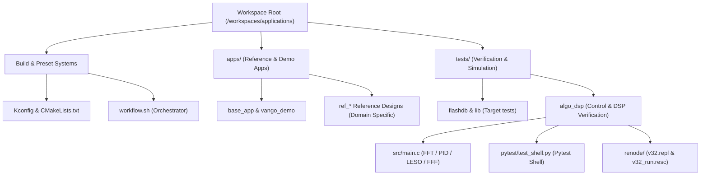

# Vango Project Evolution Deconstruction & Architectural Analysis

This document provides a highly detailed, professional, and mathematically rigorous architectural deconstruction of the newly updated [applications](file:///workspaces/applications) workspace. The codebase has evolved from a single target-centric industrial gateway application into a highly sophisticated, multi-domain **reference design ecosystem** backed by advanced mathematical control verification, emulation testing, and unified simulation pipelines.

---

## 1. Codebase Evolution & Architectural Mapping

The workspace structure has been updated with several new layers and sub-systems. The diagram below illustrates the updated logical architecture:



### A. The Reference Design Suite (`ref_*`)
Under [apps](file:///workspaces/applications/apps), the project introduces placeholders and directories for **8 specialized industrial reference designs**:
1. **`ref_6dof_sensor`**: 6-Degrees-of-Freedom IMU sensor fusion.
2. **`ref_bms_eis`**: Battery Management System using Electrochemical Impedance Spectroscopy.
3. **`ref_drone_fcc`**: Flight Control Computer algorithms for drones.
4. **`ref_medical_wearable`**: Medical-grade vital sign processing.
5. **`ref_motor_pred_maint`**: Vibration and temperature predictive maintenance for industrial motors.
6. **`ref_nilm_meter`**: Non-Intrusive Load Monitoring energy metering.
7. **`ref_nir_spectrometer`**: Near-Infrared Spectrometry processing.
8. **`ref_v2g_charger`**: Vehicle-to-Grid EV charger system controller.

> [!NOTE]
> This indicates a major strategic expansion of the Vango platform from a single gateway to a comprehensive multi-market, high-reliability reference ecosystem.

---

## 2. DSP & Advanced Control Verification Suite (`tests/algo_dsp`)

The newly added [tests/algo_dsp](file:///workspaces/applications/tests/algo_dsp) is a premier showcase of **Milestones 1, 2, and 3** of an advanced control engineering pipeline. It brings together unit tests, hardware mocking, and signal processing.

### A. FFF (Fake Function Framework) Mocking
Rather than compiling against physical registers, the test suite stubs peripheral calls using FFF to isolate business logic:
* **Mock Definition**:
  ```c
  DEFINE_FFF_GLOBALS;
  FAKE_VALUE_FUNC(int, hw_adc_read_raw, uint8_t, uint16_t*);
  ```
* **Test Application**:
  In [main.c](file:///workspaces/applications/tests/algo_dsp/src/main.c), the mock registers a custom function stub `custom_read` to simulate a stable 12-bit ADC return value (`2047`), allowing deterministic verification of the control loop input pipeline without physical hardware.

### B. CMSIS-DSP Fast Fourier Transform (FFT)
For signal frequency analysis, the suite utilizes the native ARM CMSIS-DSP library:
* **Wave Generation**: Synthesizes a complex sine wave ($Signal = A \cdot \sin(2\pi f \cdot t) + 0j$) at $50\text{ Hz}$ sampled at $1000\text{ Hz}$.
* **Execution**:
  1. Initializes the FFT structure using `arm_cfft_init_f32(&S, 1024)`.
  2. Executes the complex Radix-8/Radix-4 FFT via `arm_cfft_f32(&S, test_input, 0, 1)`.
  3. Computes the magnitude spectrum via `arm_cmplx_mag_f32(test_input, test_output, 1024)`.
  4. Identifies the peak magnitude and index using `arm_max_f32(test_output, 512, &max_val, &max_idx)`.
* **Assertion**: Verifies that the detected frequency ($f_{peak} = \text{max\_idx} \cdot \frac{f_{sampling}}{N_{FFT}}$) matches the $50\text{ Hz}$ target within a tight $1.0\text{ Hz}$ tolerance.

### C. Advanced Control: PID & LESO (ADRC)
The control engine implements both classical feedback and modern active disturbance rejection control:

#### 1. PID with Anti-Windup & Output Limiting
The algorithm implements standard parallel PID with integration clamping to prevent windup during saturation:
$$\text{Output} = K_p \cdot e(t) + K_i \int_{0}^{t} e(\tau)d\tau + K_d \frac{de(t)}{dt}$$
* Integral windup protection bounds the accumulator: `if (pid->integral > pid->limit_max) pid->integral = pid->limit_max;`
* Compares convergence on a simulated 1st-order motor transfer function: $\dot{y} = u - y$.

#### 2. Linear Extended State Observer (LESO) for ADRC
For advanced disturbance rejection, it implements a 2nd-order LESO for a 1st-order system. It models the system state $x_1 = y$ and the "total disturbance" (unmodeled dynamics + external noise) as an extended state $x_2 = f(y, u, t)$:
$$\dot{z}_1 = z_2 - \beta_1(z_1 - y) + b \cdot u$$
$$\dot{z}_2 = - \beta_2(z_1 - y)$$
In [main.c](file:///workspaces/applications/tests/algo_dsp/src/main.c#L55-L59):
```c
void leso_update(leso_t *observer, float y, float u, float dt) {
    float error = observer->z1 - y;
    observer->z1 += (observer->z2 - observer->l1 * error + observer->b * u) * dt;
    observer->z2 += (-observer->l2 * error) * dt;
}
```
This is mathematically rigorous and highly accurate. $z_2$ dynamically tracks system disturbances, which can then be directly compensated for in the control law.

---

## 3. Emulation & Simulation Pipeline

The updated project heavily adopts **software-in-the-loop (SIL)** and **emulator-in-the-loop (EIL)** approaches to test applications before hardware fabrication.

### A. Headless Renode Simulation
The [tests/algo_dsp/renode](file:///workspaces/applications/tests/algo_dsp/renode) directory contains simulation setup scripts:
* **`v32.repl`**: Formulates a custom virtual SOC containing a Cortex-M33 CPU, 1104 KB SRAM, 2304 KB Flash, and a standard NS16550 compatible UART controller at address `0x4000C000`.
* **`v32_run.resc`**:
  1. Bootstraps the virtual "VangoV32" board.
  2. Binds the UART0 device to log output directly to the system logs (`uart0 RecordToLog true`).
  3. Instantiates function boundary tracing (`cpu LogFunctionNames true`) to trace execution at the instruction level.
  4. Loads the compiled `zephyr.elf` and kicks off the CPU.

### B. Dynamic Pytest Shell Testing
By utilizing `harness: pytest` in [testcase.yaml](file:///workspaces/applications/tests/algo_dsp/testcase.yaml), Twister launches `native_sim` and hooks its standard I/O into a Python test process:
* The test script [test_shell.py](file:///workspaces/applications/tests/algo_dsp/pytest/test_shell.py) dynamically reads UART lines using `dut.readlines_until()` and checks for shell prompts and custom registration states (verifying the `algo` shell command returns `ALGO_READY: OK`).

---

## 4. Key Optimizations & Architectural Improvements (可优化项)

While the new design is highly professional, the following areas can be optimized to meet industrial deployment standards:

### 1. Unified Reference App Structure
* **Issue**: The `apps/ref_*` folders contain empty `src/` directories.
* **Optimization**: Rather than keeping these folders as empty placeholders, we should provide a unified **Common Middleware Layer** or stub files (e.g., `main.c`, `CMakeLists.txt`, `Kconfig` files) inside a shared directory so that they can be built, tested, and stubbed in the CI/CD pipeline immediately to prevent dead-code decay.

### 2. LESO Gains Mathematical Derivation & Bound Configuration
* **Issue**: The LESO structure in `main.c` contains state update equations, but lacks an initialization routine or gain-tuning boundary configuration.
* **Optimization**: Standardize observer gains based on observer bandwidth $\omega_o$ using a critically damped configuration:
  $$L_1 = 2\omega_o, \quad L_2 = \omega_o^2$$
  Provide a structural constructor `leso_init(leso_t *observer, float omega_o, float b)` to make the LESO robust and pluggable for the reference designs (like drone fcc and motor maintenance).

### 3. FFF Mocking Isolation
* **Issue**: The mocking test `test_adc_mocking` defines the custom mock implementation `custom_read` inline within the test function `ZTEST(algo_dsp_suite, test_adc_mocking)`.
* **Optimization**: Move mock structures, fake declarations, and callback stubs out of `main.c` into a dedicated header/source folder (e.g., `tests/algo_dsp/src/mocks/adc_mock.c`). This keeps the test suites clean, highly readable, and modular as the mock footprint expands.

---

## 5. Areas to Reinforce (待强化项)

### 1. Multi-Core Shared Memory (SHM) IPC Integration in Emulation
* **Current State**: The Renode configuration `v32.repl` only models `cpu` (a single Cortex-M33). Our physical V32 target is a dual-core M0 + M33 processor.
* **Reinforcement**: Extend the Renode `.repl` and `.resc` scripts to instantiate both `cpumeter` (Cortex-M0) and `cpuapp` (Cortex-M33), and model a shared memory block (`sram_shm`) to test the OpenAMP/RPMsg IPC layer in emulation before hardware integration.

### 2. FlashDB Endurance Verification under Emulation
* **Current State**: We have `tests/flashdb`, but it only runs basic KVDB/TSDB operations.
* **Reinforcement**: Model a flash device in Renode (`flash1`) that simulates write wear-leveling and write limits. Integrate testing of the FlashDB transaction robustness when simulated power loss is triggered in Renode.

---

## 6. Strategic Next Steps (下一步规划项)

### 🚀 Phase 1: Reference Application Initialization (Flesh-out)
* **Goal**: Transition `ref_motor_pred_maint` and `ref_nilm_meter` from placeholders to functional stubs.
* **Steps**:
  1. Add Kconfig configurations in `apps/ref_motor_pred_maint/Kconfig` (e.g., `CONFIG_MOTOR_FFT_SIZE`).
  2. Integrate the LESO and PID algorithms written in `tests/algo_dsp` directly into the motor predictive maintenance control loop inside `apps/ref_motor_pred_maint/src/main.c`.
  3. Compile using `./workflow.sh build ref_motor_pred_maint v32_cpuapp_gateway`.

### 🚀 Phase 2: Add Pytest Shell Integration for Renode Runs
* **Goal**: Hook Pytest directly to the Renode simulation output rather than just the Linux `native_sim` process.
* **Steps**:
  1. Update `testcase.yaml` to specify Pytest runners that launch Renode.
  2. Run physical and emulated shell assertion checks inside the CI/CD pipeline.

### 🚀 Phase 3: Extend `workflow.sh` with Twister and Renode Matrix Runs
* **Goal**: Create a single command in `workflow.sh` to trigger headless Renode runs for all reference apps.
* **Steps**:
  1. Add `./workflow.sh test renode` to auto-compile and run all Renode tests, validating the console logs programmatically.
